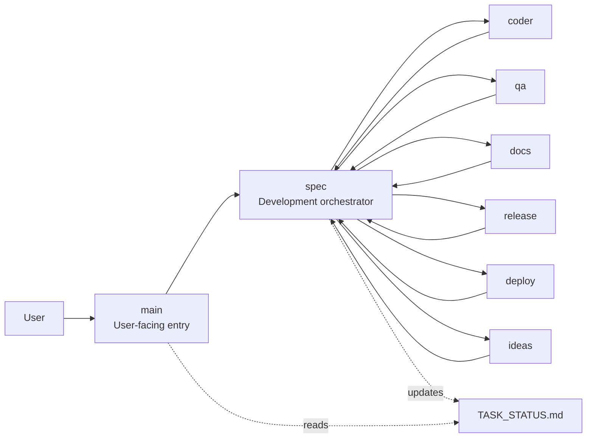

# OpenClaw Azure VM Multi-Agent One-Page Overview

## What It Is

This Azure VM uses OpenClaw as a controlled software-delivery system rather than a single general assistant.

- `main` is the only user-facing entry point
- `spec` is the central development orchestrator
- specialist agents handle coding, QA, documentation, release, deployment, and ideation

## How It Works

- user requests enter through `main`
- development work is handed to `spec`
- `spec` dispatches specialist agents based on the current need
- progress is tracked through a shared `TASK_STATUS.md` board
- bounded delegation, isolated workspaces, and tool restrictions keep collaboration controlled

## Why It Matters

- keeps one clear user conversation
- separates planning, implementation, testing, and delivery responsibilities
- makes task ownership, blockers, and next handoff visible
- supports repeatable collaboration on a deployed Azure VM

## Simplified Architecture

## One-Slide PPT

### Title

OpenClaw Azure VM Multi-Agent Architecture for Software Delivery

### Key Message

One public entry agent coordinates a controlled team of specialist agents for planning, coding, testing, documentation, release, deployment, and improvement.

### Slide Bullets

- `main` keeps the user conversation simple and continuous
- `spec` acts as the single orchestration layer for development work
- specialist agents split delivery into clear responsibilities
- `TASK_STATUS.md` provides shared visibility into owner, blocker, and next step
- isolated state and bounded delegation make the workflow safe and manageable

### Closing Line

This design turns AI-assisted development from ad hoc prompt chaining into a traceable execution workflow.
